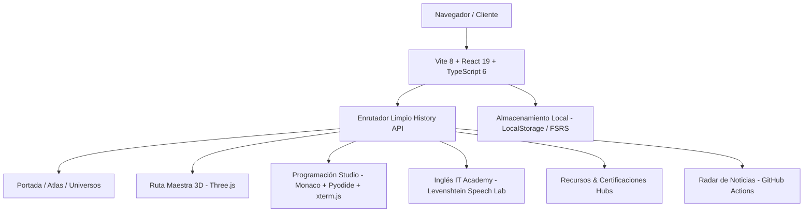

# Campus Maestro

[](https://vitejs.dev/)
[](https://react.dev/)
[](https://www.typescriptlang.org/)
[](https://threejs.org/)
[](https://microsoft.github.io/monaco-editor/)
[](https://opensource.org/licenses/MIT)
[](https://campusmaestro.is-a-fullstack.dev)

> **Sistema Operativo y Universidad Abierta de Computación e Informática Integral en español.**  
> Formación autodidacta rigurosa desde cero absoluto hasta especialización profesional, investigación y frontera tecnológica, bajo una política estricta de **costo obligatorio S/0**.

**Sitio web oficial en producción:** [https://campusmaestro.is-a-fullstack.dev](https://campusmaestro.is-a-fullstack.dev)

---

## Tabla de Contenidos

1. [Estado Actual del Proyecto](#estado-actual-del-proyecto)
2. [¿Qué es Campus Maestro?](#qué-es-campus-maestro)
3. [Ecosistema y Módulos Principales](#ecosistema-y-módulos-principales)
   - [Ruta Maestra 3D (Carretera Cinemática)](#1-ruta-maestra-3d-carretera-cinemática)
   - [Programación Studio Real](#2-programación-studio-real)
   - [Inglés IT Academy & Laboratorio Fonético](#3-inglés-it-academy--laboratorio-fonético)
   - [Atlas Profesional & Universos Conectados](#4-atlas-profesional--universos-conectados)
   - [Hubs de Recursos y Certificaciones](#5-hubs-de-recursos-y-certificaciones)
   - [Radar de Noticias Tecnológicas Automatizado](#6-radar-de-noticias-tecnológicas-automatizado)
   - [Tutor Contextual Pingo](#7-tutor-contextual-pingo)
4. [Arquitectura Técnica](#arquitectura-técnica)
5. [Enrutamiento Limpio (Clean URLs)](#enrutamiento-limpio-clean-urls)
6. [Cómo Ejecutar Localmente](#cómo-ejecutar-localmente)
7. [Auditorías y Control de Calidad](#auditorías-y-control-de-calidad)
8. [Estructura del Repositorio](#estructura-del-repositorio)
9. [Principios de Diseño y Filosofía](#principios-de-diseño-y-filosofía)
10. [Estado de Desarrollo](#estado-de-desarrollo)
11. [Autor y Licencia](#autor-y-licencia)

---

## Estado Actual del Proyecto

Campus Maestro se encuentra en la versión **V52.5 (Studio Real & Clean Routing)**:
- **Enrutamiento:** URLs limpias nativas vía History API (`/inicio`, `/ruta`, `/programacion`, `/ingles`, `/recursos`, `/certificaciones`, `/noticias`, `/perfil`, `/soporte`) sin `#` y con soporte de recarga directa en GitHub Pages (`404.html` SPA restore).
- **Programación:** Entorno interactivo V52.5 con editor profesional Monaco Editor, terminal didáctica xterm.js, ejecución segura de JavaScript en Web Worker y Python en Pyodide en el navegador.
- **Inglés IT:** Currículo completo E00–E47 (A1 a C2) con laboratorio fonético IPA, evaluación por micrófono mediante distancia de Levenshtein (*Speech Lab*), *Sentence Builder* de sintaxis técnica y *Writing Studio*.
- **Ruta Maestra:** Experiencia inmersiva 3D V45.3 con Three.js / React Three Fiber, carretera continua, iluminación adaptativa, ciclos Día/Atardecer/Noche, 20 etapas troncales (S0–S19), 89 materias y 12 maestrías (T01–T12).

---

## ¿Qué es Campus Maestro?

Campus Maestro no es un catálogo estático de cursos ni una colección desordenada de enlaces. Es una **arquitectura pedagógica integral** diseñada para conectar en una sola trayectoria coherente los fundamentos universitarios, la práctica de ingeniería de software, la investigación científica y la especialización tecnológica.

### El Método Maestro (5 Fases)
El avance no se mide por videos vistos, sino por competencias verificables:
1. **Comprende:** Estudio conceptual de la teoría con fuentes académicas rigurosas.
2. **Practica:** Laboratorios y ejercicios guiados en código real.
3. **Construye:** Desarrollo de sistemas, herramientas y proyectos integradores.
4. **Demuestra:** Gates de aprobación con entregables reproducibles y evidencia técnica.
5. **Actualiza:** Mantenimiento continuo ante la evolución de los estándares de la industria.

---

## Ecosistema y Módulos Principales

### 1. Ruta Maestra 3D (Carretera Cinemática)
- **Visualizador espacial 3D:** Carretera continua interactiva con Three.js, React Three Fiber y Drei, con sombras suaves, tráfico dinámico, distritos temáticos y modo Día/Atardecer/Noche.
- **Tronco Académico S0–S19 (89 materias):** Cubre desde nivelación, matemáticas discretas, arquitectura y sistemas operativos, hasta compiladores, inteligencia artificial, sistemas distribuidos, ciberseguridad, robótica y métodos formales.
- **12 Rutas de Maestría T01–T12 (60 unidades especializadas):**
  - `T01`: Software, Web, Móvil y Plataformas
  - `T02`: Ciberseguridad, Privacidad, DFIR y Seguridad Ofensiva Ética
  - `T03`: Datos, Bases de Datos, BI e Ingeniería de Datos
  - `T04`: Cloud, DevOps, SRE, Plataforma e Infraestructura de Internet
  - `T05`: Sistemas de Información, ITSM, Gobierno, Auditoría y Gestión
  - `T06`: Inteligencia Artificial, ML, Modelos Fundacionales y Agentes
  - `T07`: Robótica, IoT, Control, Automatización y Sistemas Ciberfísicos
  - `T08`: Hardware, Arquitectura de Computadores, FPGA/ASIC y HPC
  - `T09`: Redes, Telecomunicaciones, Inalámbrico, 6G y Espacio
  - `T10`: HCI, UX, Gráficos por Computadora, Videojuegos y XR
  - `T11`: Computación Científica, Simulación y Bioinformática
  - `T12`: Legado, Métodos Formales, Computación Cuántica y Frontera
- **Sistema de Repaso Espaciado:** Algoritmo FSRS integrado (`ts-fsrs`) para consolidación de conceptos a largo plazo.

### 2. Programación Studio Real
- **Editor Profesional:** Monaco Editor 0.55.1 con TypeScript `ScriptTarget.ESNext`, diagnósticos en tiempo real, pestañas de archivos y minimapa.
- **Terminal Educativa:** xterm.js 6.0 con comandos interactivos de laboratorio (`help`, `ls`, `pwd`, `open`, `cat`, `run`, `test`, `clear`, `reset`).
- **Runtimes en el Navegador:**
  - **JavaScript:** Ejecución aislada en Web Worker.
  - **Python:** Entorno completo en WebAssembly mediante Pyodide.
  - **Web Frontend:** Previsualización en vivo de HTML/CSS/JS en iframe sandbox.
- **Plan Curricular L00–L47 (48 niveles / 192 conceptos):** De cero absoluto (variables, tipos, flujo) hasta estructuras de datos, concurrencia, sistemas y compiladores.

### 3. Inglés IT Academy & Laboratorio Fonético
- **48 Niveles Técnicos E00–E47:** Alineados con el marco CEFR (A1 a C2), enfocados exclusivamente en comunicación técnica, ingeniería de software, arquitectura, terminal y entornos profesionales.
- **Laboratorio Fonético con IPA Unicode:** Transcripciones fonéticas exactas, guías de pronunciación aproximada en español (*sounds-like*) y ejercicios de pares mínimos (*Minimal Pairs*).
- **Speech Lab con Evaluación Fonética:** Reconocimiento de voz por micrófono en el navegador, análisis de precisión (0–100%) mediante algoritmo de alineación por distancia de Levenshtein y feedback de tokens coloreados (`match`, `substitution`, `deletion`, `insertion`).
- **Sentence Builder:** Construcción interactiva de oraciones y comandos técnicos arrastrando y ordenando tokens con síntesis de voz (`SpeechSynthesis`).
- **Writing Studio:** Simulador de comunicación profesional (pull requests, code reviews, tickets y reportes de incidencias).

### 4. Atlas Profesional & Universos Conectados
- **Atlas de Carreras:** Mapeo de más de **2,220 denominaciones y perfiles profesionales** del sector tecnológico global categorizados en 14 familias profesionales.
- **08 Universos Conectados:** Fundamentos, Software, IA, Seguridad, Datos, Infraestructura, Hardware y Frontera.
- **Visor Solar 3D:** Muestra los dominios de conocimiento del campus orbitando en un sistema solar interactivo.

### 5. Hubs de Recursos y Certificaciones
- **Recursos Hub V36:** Catálogo vivo de libros abiertos, documentación oficial universitaria, tutoriales y repositorios seleccionados por nivel de rigor.
- **Certificaciones Hub V1:** Directorio de certificaciones y acreditaciones gratuitas o con rutas de aprendizaje abiertas de la industria (Linux Foundation, CNCF, Cloud, Cisco, etc.).

### 6. Radar de Noticias Tecnológicas Automatizado
- Actualización desatendida **cada 12 horas (inicio del día y medio día) mediante GitHub Actions**.
- Agregación, deduplicación y categorización de fuentes líderes en español (Xataka, Genbeta, RedesZone, MuyComputer, ADSLZone, SoftZone, Hipertextual).
- 10 noticias seleccionadas por tarjeta temática (IA & Software, Ciberseguridad & Redes, Hardware & Sistemas, Datos & Frontera).

### 7. Tutor Contextual Pingo
- Asistente animado con estética voxel que acompaña al estudiante en cada sección con consejos pedagógicos y ayuda contextual.

---

## Arquitectura Técnica

Campus Maestro está construido como una Single Page Application (SPA) modular de alto rendimiento sin requerir backend de pago:



### Tecnologías Clave
- **Frontend Core:** React 19, TypeScript 6, Vite 8.
- **Gráficos 3D & Animaciones:** Three.js r185, `@react-three/fiber`, `@react-three/drei`, GSAP, Motion, Lenis Scroll.
- **Entorno de Código & Terminal:** `monaco-editor` 0.55.1, `@xterm/xterm` 6.0.0, `@xterm/addon-fit` 0.11.0, Pyodide (Python WASM).
- **Estilos & UI:** CSS nativo modular, Tailwind CSS 4, Radix UI, Lucide Icons, Tabler Icons.
- **Pedagogía & Algoritmos:** `ts-fsrs` (Spaced Repetition), Levenshtein Distance Token Alignment.

---

## Enrutamiento Limpio (Clean URLs)

El sistema de navegación de Campus Maestro opera con **Clean URLs** basadas en la API de Historial del navegador:

| URL Limpia | Alias Soportados | Módulo / Sección |
| :--- | :--- | :--- |
| **`/`** o **`/inicio`** | `/inicio` | Portada, Método Maestro y Atlas Profesional |
| **`/ruta`** | `/campus`, `/roadmap`, `/maestrias`, `/atlas` | Ruta Maestra 3D y Plan de Estudios S0–S19 |
| **`/programacion`** | `/programacion` | Code Studio y Academia L00–L47 |
| **`/ingles`** | `/ingles` | Inglés IT Academy y Speech Lab E00–E47 |
| **`/recursos`** | `/recursos` | Hub de Recursos y Documentación |
| **`/certificaciones`** | `/certificaciones` | Hub de Certificaciones Abiertas |
| **`/noticias`** | `/noticias` | Radar Tecnológico Automatizado |
| **`/perfil`** | `/perfil` | Portafolio Profesional de Julio H. Vera Palacios |
| **`/soporte`** | `/soporte` | Soporte y Tutor Pingo |

*Compatibilidad retroactiva:* Cualquier enlace antiguo con almohadilla (ej. `/#ingles` o `/#ruta`) es detectado y normalizado automáticamente a su URL limpia (`/ingles`, `/ruta`) sin recarga de página.

---

## Cómo Ejecutar Localmente

### Requisitos Previos
- **Node.js:** Versión 22.13.0 o superior recomendada.
- **npm:** Versión 10+ o gestor de paquetes compatible.

### Instalación y Puesta en Marcha

1. **Clonar el repositorio:**
   ```bash
   git clone https://github.com/JulioHVPalacios/roadmap-maestro-computacion.git
   cd roadmap-maestro-computacion
   ```

2. **Instalar dependencias:**
   ```bash
   npm install
   ```

3. **Iniciar el servidor de desarrollo:**
   ```bash
   npm run dev
   ```
   Abre tu navegador en `http://localhost:5182/`.

4. **Compilar para producción:**
   ```bash
   npm run build
   ```

5. **Previsualizar la compilación de producción:**
   ```bash
   npm run preview
   ```

---

## Auditorías y Control de Calidad

El proyecto cuenta con una suite completa de auditorías automatizadas que verifican la integridad pedagógica, consistencia curricular y compatibilidad técnica:

```bash
# Auditoría de Inglés IT V52 (IPA Unicode, E00-E47, Levenshtein, currículo)
node scripts/audit-english-v52.mjs

# Auditoría de Programación V52.5 (L00-L47, Monaco, xterm, Pyodide, cero absoluto)
node scripts/audit-programming-v52.mjs

# Auditoría de Ruta Maestra V45 (S0-S19, 89 materias, 12 maestrías, Atlas)
node scripts/audit-master-route-v45.mjs

# Auditoría de Ruta Premium V45.3 (Escena 3D, iluminación, Three.js)
node scripts/audit-route-premium-v453.mjs

# Comprobación de tipos TypeScript
npm run typecheck

# Análisis estático ESLint
npm run lint
```

---

## Estructura del Repositorio

```text
├── .github/
│   └── workflows/              # Despliegue en GitHub Pages y automatización de noticias
├── docs/                       # Documentación técnica, criterios pedagógicos y auditorías
├── public/                     # Assets públicos, audio, covers, 404.html para SPA
├── scripts/                    # Scripts de auditoría curricular y generadores de datos
├── src/
│   ├── components/             # Componentes transversales (SolarHero, visualizadores)
│   ├── v41/                    # Enrutador Clean URLs, cabecera V41, Pingo Tutor
│   ├── v43/                    # Catálogo profesional y currículo troncal
│   ├── v44/                    # Ecosistemas de fuentes y canon mínimo
│   ├── v45/                    # Escena 3D, carretera inmersiva y MasterRouteV45
│   ├── v51/                    # Datos curriculares de Programación e Inglés IT
│   ├── v52/                    # Code Studio (Monaco/xterm), EnglishClassroomV52 y Speech Lab
│   ├── App.tsx                 # Portal clásico y vistas complementarias
│   ├── main.tsx                # Punto de entrada de la aplicación React
│   └── roadmap-data.ts         # Datos protegidos del tronco académico S0–S19
├── index.html                  # HTML principal con restaurador de SPA redirect
├── package.json                # Dependencias y scripts de construcción
└── vite.config.ts              # Configuración de empaquetado Vite
```

---

## Principios de Diseño y Filosofía

1. **Costo Obligatorio S/0:** Todo el conocimiento esencial para graduarse con honores autodidactas en computación es accesible sin pagar suscripciones, licencias privativas ni certificados obligatorios.
2. **Español Primero:** El lenguaje primario de toda la enseñanza, teoría, explicaciones y glosarios es el español riguroso.
3. **Sin Gamificación Frívola ni Bloques Infantiles:** No se utilizan sistemas de puntos decorativos, XP, vidas ni programación en bloques (Blockly). Se enseña con herramientas estándar de la industria (Monaco Editor, terminal, código real).
4. **Respeto a la Privacidad:** El progreso se almacena localmente en el dispositivo del usuario. No se rastrea ni se recopila información personal sin consentimiento.

---

## Estado de Desarrollo

- [x] **Tronco Académico S0–S19:** 89 materias con fuentes, gates y proyectos integradores (100% completado).
- [x] **12 Rutas de Maestría T01–T12:** 60 unidades especializadas con evidencias (100% completado).
- [x] **Ruta Maestra 3D Cinemática:** Carretera interactiva, iluminación urbana y cámaras (100% completado).
- [x] **Programación Studio V52.5:** 48 niveles L00–L47 con Monaco Editor y xterm.js (100% completado).
- [x] **Inglés IT Academy V52:** 48 niveles E00–E47 con Speech Lab y fonética IPA (100% completado).
- [x] **Enrutador Clean URLs:** URLs limpias sin hash con fallback 404 para GitHub Pages (100% completado).
- [x] **Radar de Noticias Automatizado:** Actualización cada 12 horas (00:00 y 12:00) vía GitHub Actions con 10 noticias por card (100% completado).
- [ ] **Laboratorios Avanzados de Computación Cuántica y FPGA WebAssembly:** En fase de diseño conceptual para futuras iteraciones.

---

## Autor y Licencia

- **Autor:** Julio Humberto Vera Palacios
- **Licencia del Código:** [MIT License](LICENSE)
- **Recursos Externos:** Los materiales, libros, papers y cursos referenciados pertenecen a sus respectivos autores e instituciones y conservan sus licencias originales.
